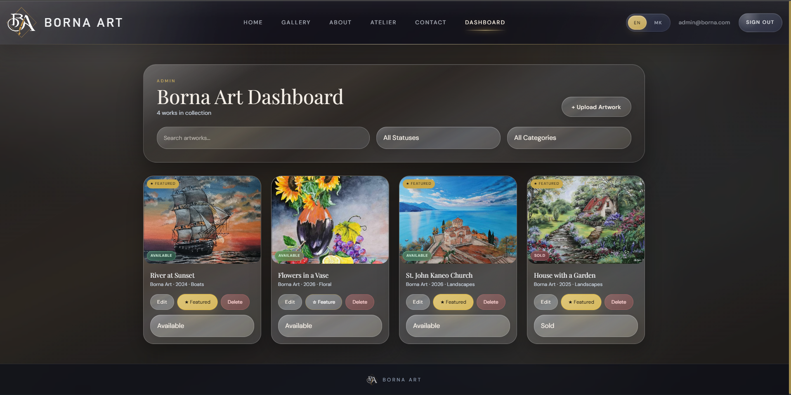

# 🎨 Borna Art Gallery

<p align="center">
  <b>Production-ready full-stack art gallery platform</b><br/>
  Premium UI • Secure Admin Dashboard • Scalable Architecture
</p>

---

## 🌐 Live Application

<p align="center">
  <a href="https://bornaart.netlify.app" target="_blank"><b>Visit Live App</b></a>
</p>

---

## 🎬 Product Preview

### 🖥️ Desktop Experience

<p align="center">
  
</p>

<p align="center"><i>Smooth, premium carousel with focus-based artwork presentation</i></p>

---

### 📱 Mobile Experience

<p align="center">
  
</p>

<p align="center"><i>Fully responsive, touch-optimized browsing experience</i></p>

---

### 🛠️ Admin Dashboard

<p align="center">
  
</p>

<p align="center"><i>Secure and intuitive interface for managing artworks and media</i></p>

---

## 🧩 Overview

**Borna Art Gallery** is a modern, bilingual web application designed to:

* Showcase original artwork in a **premium, gallery-style UI**
* Provide a seamless browsing experience across **desktop and mobile**
* Enable secure **admin-side content management**
* Support **real-world deployment and scalability**

Built with a **production mindset**, focusing on performance, security, and clean architecture.

---

## 🚀 Core Features

### 🎨 Public Experience

* Elegant artwork gallery with **carousel-based navigation**
* Advanced filtering:

  * Category
  * Dimensions
  * Orientation
  * Availability (AVAILABLE / SOLD)
* Smooth modal previews with responsive scaling
* Fully bilingual content (**🇬🇧 English / 🇲🇰 Macedonian**)
* Dedicated sections:

  * Artist / About
  * Atelier
  * Creative Process
  * Contact

---

### 👤 User Features

* Secure registration & authentication
* Save and manage **favorite artworks**
* Persistent user-specific data via backend authorization

---

### 🛠️ Admin Dashboard

* Full CRUD management of artworks
* Image upload & replacement via Cloudinary
* Toggle:

  * Featured artworks
  * Availability status
* Manage bilingual content (EN / MK)
* Secure access control (admin-only routes)

---

### ⚡ Smart Features

* Automatic translation (OpenAI-compatible API)
* Server-side validation
* Rate limiting for sensitive endpoints
* Optimized CDN media delivery

---

## 🏗️ Architecture & Tech Stack

### Frontend

* React + TypeScript
* Vite
* Tailwind CSS
* React Router
* Axios
* i18next

---

### Backend

* Java 21
* Spring Boot
* Spring Security (JWT)
* Spring Data JPA
* PostgreSQL

---

### Infrastructure

* Supabase (Database + RLS)
* Cloudinary (Media CDN)
* Netlify (Frontend)
* Render (Backend)
* OpenAI-compatible API

---

## 📁 Project Structure

```
frontend/   → React app
backend/    → Spring Boot API
supabase/   → migrations & RLS
schema.sql  → database schema
render.yaml → deployment config
```

---

## 🔒 Security

* JWT authentication (stateless)
* HttpOnly refresh tokens
* Role-based access control
* Rate limiting (Bucket4j)
* Server-side validation
* Secure media handling

---

## ⚙️ Local Setup

### Prerequisites

* Node.js
* Java 21
* Maven
* PostgreSQL / Supabase
* Cloudinary account

---

### ▶️ Frontend

```bash
cd frontend
npm install
npm run dev
```

---

### ▶️ Backend

```bash
cd backend
mvn spring-boot:run
```

---

## 🚀 Deployment

| Layer    | Service    |
| -------- | ---------- |
| Frontend | Netlify    |
| Backend  | Render     |
| Database | Supabase   |
| Media    | Cloudinary |

---

## 📈 Production Ready

* Full deployment pipeline
* Secure auth system
* CDN media optimization
* Scalable architecture
* Clean modular structure
* Mobile-first design

---

## 🧠 Design Philosophy

* Single-artist focused
* Performance-first
* Clean UX/UI
* Easily extendable

---

## ⭐ Why This Project Stands Out

* Real-world deployment (not just local)
* Full authentication & security layer
* Professional UI/UX polish
* Scalable backend architecture
* Production-level media handling

---

## 📬 Contact

Use in-app contact options to reach the artist.

---

<p align="center"><b>Built with precision, performance, and attention to detail.</b></p>
